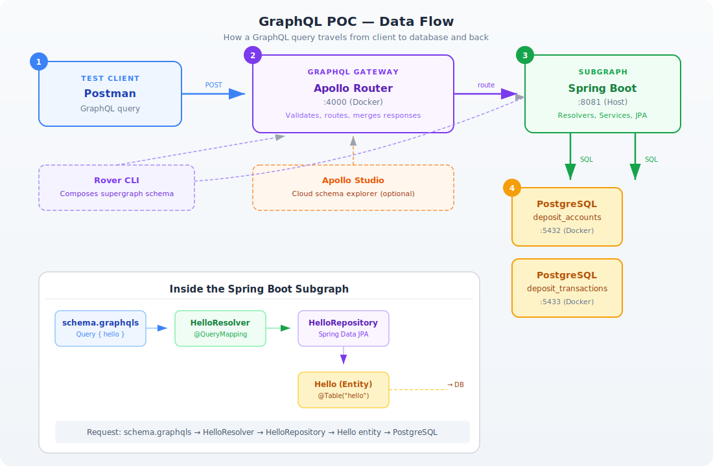
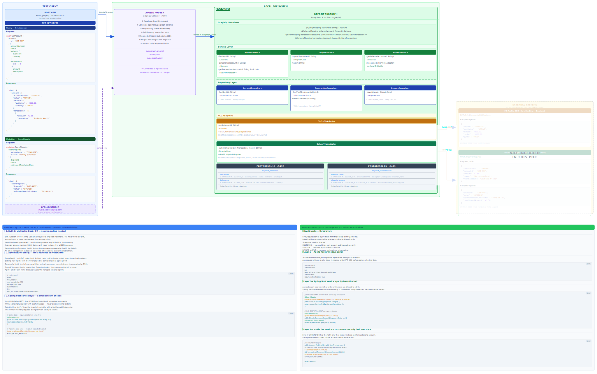

# GraphQL POC — Federated GraphQL with Apollo & Spring Boot

A proof-of-concept demonstrating **Apollo Federation 2** with a **Spring Boot GraphQL subgraph**, two PostgreSQL databases, and the Apollo Router as the gateway.

---

## Quick Start

| Step | Command | When |
|---|---|---|
| **1. Install tools** | `./_installation/scripts/install-host-prerequisites.sh` | Once per machine |
| **2. Start infra** | `cd installation && ./scripts/start.sh` | Each work session |
| **3. Run subgraph** | `cd deposit-subgraph && ./gradlew bootRun` | Each work session |
| **4. Compose schema** | `cd installation && ./scripts/compose-supergraph.sh` | After schema changes |
| **5. Test** | See [Test the Full Flow](#test-the-full-flow) | Anytime |

> For detailed installation steps, see [_installation/INSTALLATION.md](_installation/INSTALLATION.md).

---

## Architecture

### High-Level Data Flow

<p align="center">
  
</p>

### How a GraphQL Query Travels

A client sends a GraphQL query. Here's how it flows through the system:

```
 ┌─────────────┐     ┌──────────────────┐     ┌─────────────────┐     ┌───────────────────────────┐
 │   POSTMAN    │────▶│  APOLLO ROUTER   │────▶│  SPRING BOOT    │────▶│       POSTGRESQL          │
 │  (client)    │◀────│  :4000 (Docker)  │◀────│  :8081 (Host)   │◀────│  :5432        :5433       │
 └─────────────┘     └──────────────────┘     └─────────────────┘     │  accounts    transactions  │
      Step 1               Step 2                   Step 3            │  balances                  │
   Send query         Validate & route          Resolve fields        └───────────────────────────┘
                                                                              Step 4
                                                                           Fetch data
```

**Step 1 — Client sends query:**
The client (Postman, Apollo Studio, or any HTTP client) sends a GraphQL query to the Apollo Router at `localhost:4000`.

**Step 2 — Router validates and routes:**
Apollo Router receives the query, validates it against the composed supergraph schema, and routes it to the correct subgraph (our Spring Boot app).

**Step 3 — Subgraph resolves fields:**
Spring Boot receives the query, matches it to a resolver (`@QueryMapping`), which calls the service layer, then repositories to fetch data via JPA.

**Step 4 — Database returns data:**
PostgreSQL executes the SQL query and returns rows. The data flows back: DB → JPA Entity → Repository → Service → Resolver → Router → Client.

### Detailed Architecture Diagram

<p align="center">
  
</p>

---

## Project Structure

```
poc_graphql/
├── README.md                        ← this file
├── graphql_poc_architecture.svg     ← full architecture diagram
├── graphql_poc_data_flow.svg        ← data flow diagram
├── _installation/                    ← infrastructure setup (see INSTALLATION.md)
│   ├── INSTALLATION.md              ← Phase 1 & 2: install tools, start infra
│   ├── docker-compose.yml           ← PostgreSQL x2 + Apollo Router
│   ├── postgres/                    ← DB init scripts & seed data
│   ├── router/                      ← Apollo Router & Rover config
│   └── scripts/                     ← Start/stop/status/compose scripts
└── deposit-subgraph/                ← Spring Boot GraphQL subgraph
    ├── build.gradle                 ← Dependencies (Spring GraphQL, JPA, PostgreSQL)
    ├── gradlew                      ← Gradle wrapper
    └── src/main/
        ├── java/com/poc/graphql/
        │   ├── DepositSubgraphApplication.java
        │   ├── config/
        │   │   ├── AccountsDbConfig.java          ← DB1 datasource config
        │   │   └── TransactionsDbConfig.java       ← DB2 datasource config
        │   ├── accounts/
        │   │   ├── entity/
        │   │   │   ├── Account.java                ← @Table("accounts")
        │   │   │   └── Balance.java                ← @Table("balances")
        │   │   └── repository/
        │   │       ├── AccountRepository.java
        │   │       └── BalanceRepository.java
        │   ├── transactions/
        │   │   ├── entity/
        │   │   │   └── Transaction.java            ← @Table("transactions")
        │   │   └── repository/
        │   │       └── TransactionRepository.java
        │   ├── service/
        │   │   └── AccountService.java             ← Business logic layer
        │   └── resolver/
        │       └── AccountResolver.java            ← @QueryMapping
        └── resources/
            ├── application.yml              ← Multi-datasource config (DB1 + DB2)
            └── graphql/schema.graphqls      ← GraphQL schema (READ queries)
```

---

## Develop the Spring Boot Subgraph

> **Prerequisite:** Infrastructure must be running (Phase 2 in [INSTALLATION.md](_installation/INSTALLATION.md)).

### How the Subgraph Works

The Spring Boot subgraph is a standard Spring Boot app with **Spring for GraphQL**. Here's how the pieces connect:

```
schema.graphqls          →  Defines what queries are available
        ↓
AccountResolver.java     →  Maps GraphQL queries to Java methods (@QueryMapping)
        ↓
AccountService.java      →  Business logic and data aggregation (@Service)
        ↓
AccountRepository.java   →  Spring Data JPA interface (auto-generates SQL)
        ↓
Account.java (Entity)    →  Maps to the "accounts" table in PostgreSQL
        ↓
PostgreSQL               →  Stores the actual data (2 databases)
```

### Multi-Datasource Architecture

This POC connects to **two separate PostgreSQL databases** simultaneously:

| Database | Port | Contains | Config Class |
|---|---|---|---|
| `deposit_accounts` | :5432 | accounts, balances | `AccountsDbConfig.java` |
| `deposit_transactions` | :5433 | transactions | `TransactionsDbConfig.java` |

Each database has its own `DataSource`, `EntityManagerFactory`, and `TransactionManager` configured via Spring's `@Configuration` classes.

### GraphQL Schema

```graphql
type Query {
    getAccount(id: ID!): Account
}

type Account {
    id: ID!
    customerId: String!
    accountNumber: String!
    status: String!
    createdAt: String
    balance: Balance
    transactions: [Transaction!]!
}

type Balance {
    id: ID!
    available: Float!
    current: Float!
    currency: String!
    updatedAt: String
}

type Transaction {
    id: ID!
    amount: Float!
    description: String!
    merchant: String
    txnDate: String
}
```

### Code Walkthrough

**Resolver** (`AccountResolver.java`) — entry point for GraphQL queries:
```java
@Controller
public class AccountResolver {
    private final AccountService accountService;

    @QueryMapping
    public Account getAccount(@Argument String id) {
        return accountService.getAccount(id).orElse(null);
    }

    @SchemaMapping(typeName = "Account", field = "balance")
    public Balance balance(Account account) {
        return accountService.getBalance(account.getId());
    }

    @SchemaMapping(typeName = "Account", field = "transactions")
    public List<Transaction> transactions(Account account) {
        return accountService.getTransactions(account.getId());
    }
}
```

**Service** (`AccountService.java`) — aggregates data from both databases:
```java
@Service
public class AccountService {
    private final AccountRepository accountRepository;
    private final BalanceRepository balanceRepository;
    private final TransactionRepository transactionRepository;

    public Optional<Account> getAccount(String id) {
        return accountRepository.findById(id);
    }

    public Balance getBalance(String accountId) {
        return balanceRepository.findByAccountId(accountId);
    }

    public List<Transaction> getTransactions(String accountId) {
        return transactionRepository.findByAccountIdOrderByTxnDateDesc(accountId);
    }
}
```

### Build & Run

```bash
cd deposit-subgraph/
./gradlew bootRun
```

Wait for: `Started DepositSubgraphApplication`

Test directly:
```bash
curl -s http://localhost:8081/graphql \
  -H "Content-Type: application/json" \
  -d '{"query":"{ getAccount(id: \"ACT-234\") { accountNumber status balance { available current currency } transactions { description amount merchant } } }"}' | jq .
```

Expected response:
```json
{
  "data": {
    "getAccount": {
      "accountNumber": "****1234",
      "status": "ACTIVE",
      "balance": {
        "available": 4850.00,
        "current": 5100.00,
        "currency": "USD"
      },
      "transactions": [
        { "description": "Starbucks #4421", "amount": -42.50, "merchant": "Starbucks" },
        { "description": "Amazon.com", "amount": -125.00, "merchant": "Amazon" },
        { "description": "Direct Deposit - Payroll", "amount": 2500.00, "merchant": null }
      ]
    }
  }
}
```

---

## Compose Supergraph & Test End-to-End

> **Prerequisite:** Spring Boot subgraph must be running on `:8081`.

### Compose the Supergraph

```bash
cd _installation/
./scripts/compose-supergraph.sh
```

This uses **Rover CLI** to:
1. Introspect the Spring Boot subgraph at `localhost:8081/graphql`
2. Compose a **supergraph schema** using Apollo Federation 2.7.1
3. Restart the Apollo Router with the new schema

> Re-run this after any changes to `schema.graphqls`.

### Test the Full Flow

```bash
# Query through the Apollo Router (full path: Client → Router → Subgraph → DB)
curl -s http://localhost:4000/ \
  -H "Content-Type: application/json" \
  -d '{"query":"{ getAccount(id: \"ACT-234\") { accountNumber balance { available } transactions { description amount } } }"}' | jq .
```

### Explore with Apollo Tools

| Tool | URL | What it does |
|---|---|---|
| **Apollo Sandbox** | http://localhost:4000 | Local GraphQL IDE (built into Router) |
| **GraphiQL** | http://localhost:8081/graphiql | Spring Boot's built-in GraphQL IDE |
| **Apollo Studio** | https://studio.apollographql.com/ | Cloud-based schema explorer (optional) |

---

## Component Summary

| Component | Tech | Port | Runs In | Purpose |
|---|---|---|---|---|
| **Test Client** | Postman | — | Host | Send GraphQL queries |
| **Apollo Router** | Apollo Router v1.57.1 | :4000 | Docker | GraphQL Gateway (Federation) |
| **Deposit Subgraph** | Spring Boot 3.3 + Java 21 | :8081 | Host | GraphQL subgraph + business logic |
| **Database 1** | PostgreSQL 15 | :5432 | Docker | accounts, balances |
| **Database 2** | PostgreSQL 15 | :5433 | Docker | transactions |
| **Apollo Studio** | Cloud | — | Browser | Schema explorer (optional) |

---

## Seed Data

The databases come pre-loaded with sample data:

**Accounts (DB1 :5432)**
| ID | Account # | Status | Balance (available / current) |
|---|---|---|---|
| ACT-234 | ****1234 | ACTIVE | $4,850.00 / $5,100.00 |
| ACT-567 | ****5678 | ACTIVE | $12,340.50 / $12,340.50 |
| ACT-890 | ****9012 | DORMANT | $200.00 / $200.00 |

**Transactions (DB2 :5433)**
| ID | Account | Amount | Merchant | Date |
|---|---|---|---|---|
| TXN-8821 | ACT-234 | -$42.50 | Starbucks | 2026-03-01 |
| TXN-8822 | ACT-234 | -$125.00 | Amazon | 2026-02-28 |
| TXN-8823 | ACT-234 | +$2,500.00 | Payroll | 2026-02-27 |
| TXN-8824 | ACT-234 | -$18.75 | Netflix | 2026-02-26 |
| TXN-8825 | ACT-234 | -$65.30 | Shell | 2026-02-25 |
| TXN-9901 | ACT-567 | -$200.00 | Walmart | 2026-03-02 |
| TXN-9902 | ACT-567 | +$5,000.00 | Wire Transfer | 2026-03-01 |
